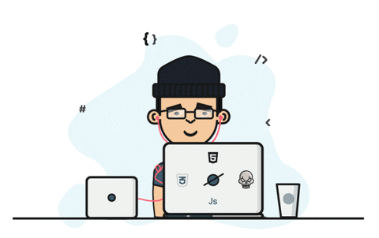

<h1 align="center">Hey 👋, I'm Vishal Purushothaman</h1>

<h3 align="center">
  Full-Stack Developer • Mobile App Enthusiast • UI/UX Learner
</h3>

  Crafting clean, scalable & modern web/mobile experiences 🚀

---

  

---

  

---

# 💫 About Me

- 🌱 Currently learning **React.js, Node.js, Flutter, React Native & Figma**
- 💻 Building modern web & mobile applications
- 🤖 Exploring **Machine Learning & AI**
- 🎨 Passionate about clean UI/UX design
- 💬 Ask me about  
  **HTML • CSS • JavaScript • Python • Android • Django**
- 📫 Reach me at:  
  **itsmevishal25@gmail.com**
- ⚡ Fun Fact:  
  *Full-stack ninja in training 🥷*

---

# 🛠️ Tech Stack

## 🚀 Languages

  

---

## ⚙️ Frameworks & Libraries

  

---

## 🤖 AI / ML Stack

  
  

`NumPy` • `Pandas` • `SciPy` • `Seaborn` • `Matplotlib` • `Scikit-Learn` • `Machine Learning`

---

## 🎨 Design & Productivity Tools

  

  
  
  
  

---

# 📊 GitHub Stats

  

  

---

# 📈 Most Used Languages

  

---

# 🌐 Connect With Me

  

  

  

---

### 💙 Thanks for visiting my profile!

⭐ *Feel free to explore my repositories and projects.*

